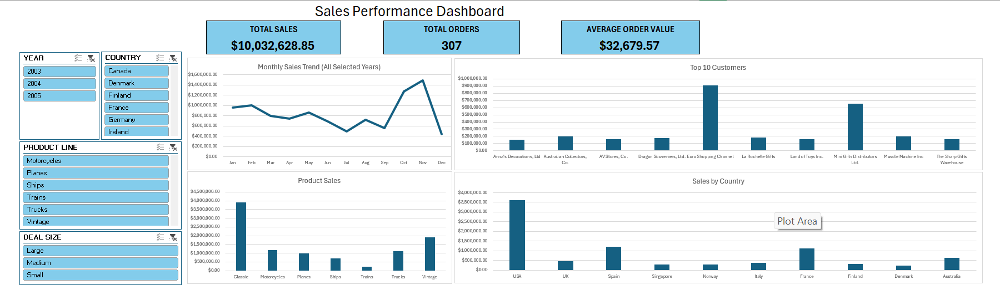

# Sales Performance Analysis

## Project Overview

This project analyzes sales data using Microsoft Excel to evaluate sales trends, product
performance, customer performance, and geographic performance.

## Dataset
The dataset used in this project is a publicly available sample sales dataset obtained from Kaggle. It was used for 
learning and portfolio purposes. The dataset contains information about orders, products, customers, sales, dates, and geographic locations.
Data Source: [Kaggle - Sample Sales Data](https://www.kaggle.com/datasets/kyanyoga/sample-sales-data/data)

## Tools Used
- Microsoft Excel
- PivotTables
- PivotCharts
- Slicers
- Excel Formulas
- Power Query

## Data Cleaning
- Checked for missing values
- Reviewed duplicate records
- Standardized phone number formatting
- Removed unnecessary spaces
- Used Power Query to separate date and time values
- Converted the order date to the appropriate date format

## Dashboard

## Key Business Insights
- November generated the highest monthly sales at $1.49 million, followed by October at $1.27 million. December recorded the lowest monthly sales at approximately $438,811.
- Classic Cars generated more than twice the sales of Vintage Cars, the second-highest product line, indicating that sales performance was heavily concentrated in the Classic Cars category.
- Euro Shopping Channel generated $912,294 in sales, making it the highest-revenue customer among the Top 10 customers analyzed.
- The United States was the strongest market, generating approximately $3.63 million in sales, followed by Spain and France.

## Skills Demonstrated
- Data Cleaning
- PivotTables
- Dashboard Design
- Business Analysis
- Data Visualization
- Power Query
